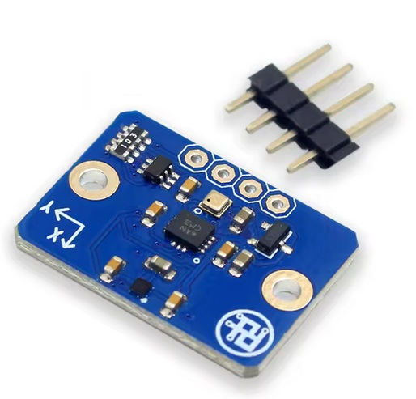

# Bosch 10-Axis IMU for Raspberry Pi

Simple and easy to understand C reference implementations for the Bosch Sensortec BMI323, BMM350, and BMP390 sensors commonly found on 10-axis IMU breakout boards. Pure C99, no dependencies, works on any Linux system with I2C.

<p align="center">
  
</p>

## Overview

This repository provides clean, readable code for three Bosch sensors:

| Sensor | Function | Output |
|--------|----------|--------|
| BMI323 | 6-axis Accelerometer + Gyroscope | Linear acceleration, angular velocity, temperature |
| BMM350 | 3-axis Magnetometer | Magnetic field vector, temperature |
| BMP390 | Barometric Pressure | Pressure, temperature, altitude |

The code has been tested on a 10-axis IMU board containing all three sensors. All I2C communication is handled through a shared common library.

## Quick Start

```bash
# Enable I2C on Raspberry Pi if not already done
sudo raspi-config
# Interface Options -> I2C -> Enable

# Clone and build
git clone https://github.com/YOUR_USERNAME/YOUR_REPO.git
cd YOUR_REPO

# Build
cd BMI323_test && make
cd ../BMM350_test && make
cd ../BMP390_test && make

# Run (may require root for I2C access depending on your setup)
./bmi323_i2c
./bmm350_i2c
./bmp390_i2c
```

## Wiring

Connect the sensor module to Raspberry Pi I2C1:

| RPi Pin | Function | Sensor |
|---------|----------|--------|
| Pin 1 | 3.3V | VCC |
| Pin 3 | GPIO2 | SDA |
| Pin 5 | GPIO3 | SCL |
| Pin 6 | GND | GND |

Default I2C addresses:
- BMI323: 0x68 or 0x69 (depends on SDO pin)
- BMM350: 0x14 or 0x15 (depends on CSB pin)
- BMP390: 0x76 or 0x77 (depends on SDO pin)

Verify connections with `sudo i2cdetect -y 1`.

## Sensor Details

### BMI323 - Inertial Measurement Unit

6-axis accelerometer and gyroscope with on-chip feature engine.

```bash
./bmi323_i2c
# Output: ax,ay,az,gx,gy,gz,temp
# Units: g,g,g,deg/s,deg/s,deg/s,C
```

Configuration:
- Accelerometer: 100Hz, 8g range
- Gyroscope: 100Hz, 2000 deg/s range
- Output rate: 20Hz

### BMM350 - Magnetometer

3-axis magnetometer with factory calibration and user hard/soft iron compensation.

```bash
# Normal mode
./bmm350_i2c

# Calibration mode (rotate sensor in figure-8 pattern)
./bmm350_i2c -c 30
```

Output: `mx,my,mz,temp` in microtesla and Celsius.

The code reads factory OTP calibration data and applies offset, sensitivity, temperature, and cross-axis corrections. User calibration is saved to `bmm350_cal.txt`.

### BMP390 - Barometric Pressure

Pressure sensor with altitude calculation.

```bash
# Standard atmosphere reference
./bmp390_i2c

# Set QNH from local weather (hPa)
./bmp390_i2c -q 1013.25

# Calibrate from known altitude (meters)
./bmp390_i2c -a 150
```

Output: `pressure,temperature,altitude` in Pa, Celsius, and meters.

## Project Structure

```
├── common/
│   ├── common.h            # I2C interface declarations
│   └── common.c            # I2C implementation
├── BMI323_test/
│   ├── bmi323_i2c.c
│   └── Makefile
├── BMM350_test/
│   ├── bmm350_i2c.c
│   └── Makefile
├── BMP390_test/
│   ├── bmp390_i2c.c
│   └── Makefile
└── image/
```

## Common I2C API

The shared library handles the differences between sensors (some require dummy bytes on read, some do not):

```c
// Setup
int i2c_init(const char *device, uint8_t addr);
void i2c_close(void);

// Read - no dummy bytes (BMP390)
int i2c_read(uint8_t reg, uint8_t *data, uint8_t len);

// Read - with 2 dummy bytes (BMI323, BMM350)
int i2c_read_with_dummy(uint8_t reg, uint8_t *data, uint8_t len);
uint16_t i2c_read16_with_dummy(uint8_t reg);

// Write
int i2c_write(uint8_t reg, uint8_t data);
int i2c_write16(uint8_t reg, uint16_t data);

// Timing
uint64_t millis(void);
void delay_ms(unsigned int ms);
void delay_us(unsigned int us);
```

## Troubleshooting

**Cannot open I2C device**
- Try running with sudo
- Enable I2C via raspi-config
- Check /dev/i2c-1 exists

**Chip ID mismatch**
- Verify power supply is 3.3V
- Check all wiring connections
- Confirm address pin configuration

**Magnetometer drift**
- Run calibration away from metal objects
- Keep away from motors and magnets
- Recalibrate after moving to new location

## References

- BMI323: https://www.bosch-sensortec.com/products/motion-sensors/imus/bmi323/
- BMM350: https://www.bosch-sensortec.com/products/motion-sensors/magnetometers/bmm350/
- BMP390: https://www.bosch-sensortec.com/products/environmental-sensors/pressure-sensors/bmp390/
- Tested hardware (10-axis IMU board): https://fr.aliexpress.com/item/1005004252794090.html

## License

MIT License.
